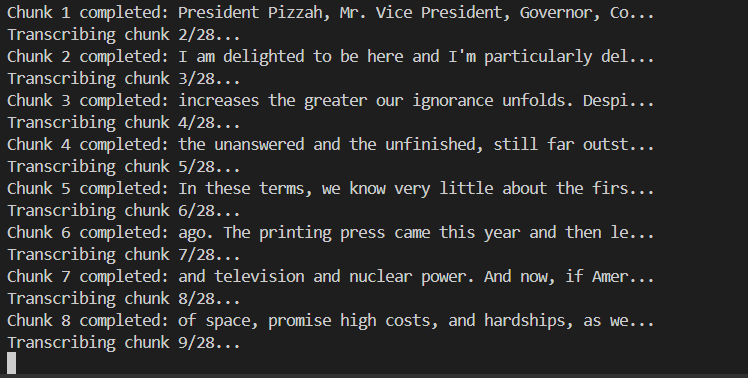
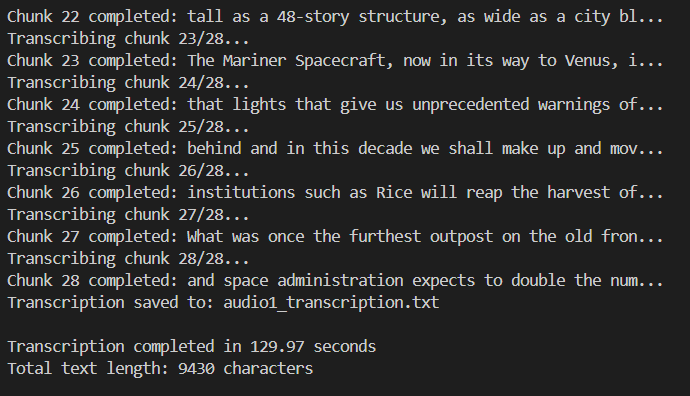
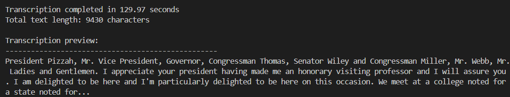

# AudioScribe

[](https://www.linkedin.com/in/pejman-ebrahimi-4a60151a7/)
[](https://huggingface.co/arad1367)
[](https://arad1367.github.io/pejman-ebrahimi/)
[](https://www.uni.li/pejman.ebrahimi?set_language=en)

<div align="center">
  
  <h3>AI-Powered Audio Transcription Tool</h3>
  <p>Transform your audio files into accurate text transcriptions using OpenAI Whisper</p>
</div>

## Table of Contents

- [Overview](#overview)
- [Features](#features)
- [Installation](#installation)
- [Usage](#usage)
- [Supported Audio Formats](#supported-audio-formats)
- [Model Options](#model-options)
- [Examples](#examples)
- [Project Structure](#project-structure)
- [Configuration](#configuration)
- [Troubleshooting](#troubleshooting)
- [Contributing](#contributing)
- [License](#license)
- [Contact](#contact)

## Overview

AudioScribe is a powerful Python application that leverages OpenAI's Whisper model to transcribe large audio files into accurate text. The tool automatically handles large files by splitting them into manageable chunks, ensuring reliable transcription even for lengthy recordings.

## Features

- 🎯 **High Accuracy**: Uses OpenAI Whisper for state-of-the-art speech recognition
- 📁 **Large File Support**: Automatically chunks large audio files for processing
- 🌍 **Multi-language**: Supports 99+ languages
- 🔄 **Multiple Formats**: Works with MP3, WAV, M4A, FLAC, OGG, and more
- ⚡ **Configurable Models**: Choose from 5 different model sizes (tiny to large)
- 🔧 **Customizable**: Adjustable chunk sizes and processing options
- 💾 **Local Processing**: No API keys required, works completely offline
- 📊 **Progress Tracking**: Real-time progress updates during transcription

## Installation

1. Clone the repository:
```bash
git clone https://github.com/arad1367/AudioScribe.git
cd AudioScribe
```

2. Install the required dependencies:
```bash
pip install -r requirements.txt
```

## Usage

1. Place your audio file in the same directory as `app.py`

2. Edit the filename in `app.py`:
```python
audio_file = "your_audio_file.mp3"  # Change this to your audio file name
```

3. Run the application:
```bash
python app.py
```

4. The transcription will be saved as `your_audio_file_transcription.txt`

## Supported Audio Formats

AudioScribe supports a wide range of audio formats:

- **MP3** - MPEG Audio Layer III
- **WAV** - Waveform Audio File Format
- **M4A** - MPEG-4 Audio
- **FLAC** - Free Lossless Audio Codec
- **OGG** - Ogg Vorbis
- **AAC** - Advanced Audio Coding
- **WMA** - Windows Media Audio
- **AIFF** - Audio Interchange File Format
- **MP4** - MPEG-4 Audio

## Model Options

Choose the right model based on your needs:

| Model | Size | Speed | Accuracy | Use Case |
|-------|------|-------|----------|----------|
| `tiny` | ~39 MB | Fastest | Basic | Quick drafts, real-time |
| `base` | ~74 MB | Fast | Good | **Default choice** |
| `small` | ~244 MB | Medium | Better | Important content |
| `medium` | ~769 MB | Slow | High | Professional use |
| `large` | ~1550 MB | Slowest | Best | Critical accuracy |

## Examples

### Sample Transcription

Here's an example of AudioScribe in action:

**Input Audio**: `audio1.mp3` (Presidential speech)

**Output Text**:
> "President Pizzah, Mr. Vice President, Governor, Congressman Thomas, Senator Wiley and Congressman Miller, Mr. Webb, Mr. Bell, scientists, distinguished guests at Ladies and Gentlemen. I appreciate your president having made me an honorary visiting professor and I will assure you that my first lecture will be a very brief..."

### Screenshots

<div align="center">
  
  
  
</div>

### Complete Example

Check the `example/` folder for:
- `audio1.mp3` - Sample audio file
- `audio1_transcription.txt` - Complete transcription output

## Project Structure

```
AudioScribe/
├── app.py                      # Main application file
├── requirements.txt            # Python dependencies
├── README.md                   # Project documentation
├── IMG/                        # Images and screenshots
│   ├── Logo.png               # Application logo
│   ├── T1.png                 # Transcription example 1
│   ├── T2.png                 # Transcription example 2
│   └── T3.png                 # Transcription example 3
└── example/                    # Example files
    ├── audio1.mp3             # Sample audio file
    └── audio1_transcription.txt # Sample transcription
```

## Configuration

You can customize the application by modifying these variables in `app.py`:

```python
# Audio file configuration
audio_file = "your_audio.mp3"           # Your audio file name

# Model configuration
model_size = "base"                     # Model size: tiny, base, small, medium, large

# Processing configuration
chunk_length_seconds = 30               # Chunk length in seconds
```

## Troubleshooting

### Common Issues

**File not found error:**
- Ensure your audio file is in the same directory as `app.py`
- Check the filename spelling and extension

**Out of memory error:**
- Use a smaller model (`tiny` or `base`)
- Reduce chunk length to 15-20 seconds

**Slow processing:**
- Use `tiny` or `base` model for faster processing
- Increase chunk length to 45-60 seconds

**Poor transcription quality:**
- Use `medium` or `large` model for better accuracy
- Ensure good audio quality (clear speech, minimal background noise)

### System Requirements

- **Python**: 3.7 or higher
- **RAM**: 4GB minimum (8GB recommended for large models)
- **Storage**: 2GB free space for models and temporary files
- **OS**: Windows, macOS, or Linux

## Contributing

Contributions are welcome! Please feel free to submit a Pull Request. For major changes, please open an issue first to discuss what you would like to change.

1. Fork the repository
2. Create your feature branch (`git checkout -b feature/AmazingFeature`)
3. Commit your changes (`git commit -m 'Add some AmazingFeature'`)
4. Push to the branch (`git push origin feature/AmazingFeature`)
5. Open a Pull Request

## License

This project is licensed under the MIT License - see the [LICENSE](LICENSE) file for details.

## Contact

**Pejman Ebrahimi** - AI/ML Engineer

- 📧 **Email**: 
  - pejman.ebrahimi@uni.li
  - pejman.ebrahimi77@gmail.com
- 💼 **LinkedIn**: [Pejman Ebrahimi](https://www.linkedin.com/in/pejman-ebrahimi-4a60151a7/)
- 🤗 **Hugging Face**: [arad1367](https://huggingface.co/arad1367)
- 🌐 **Website**: [pejman-ebrahimi.com](https://arad1367.github.io/pejman-ebrahimi/)
- 🎓 **University**: [University Profile](https://www.uni.li/pejman.ebrahimi?set_language=en)

---

<div align="center">
  <p>⭐ If you found this project helpful, please give it a star! ⭐</p>
</div>
